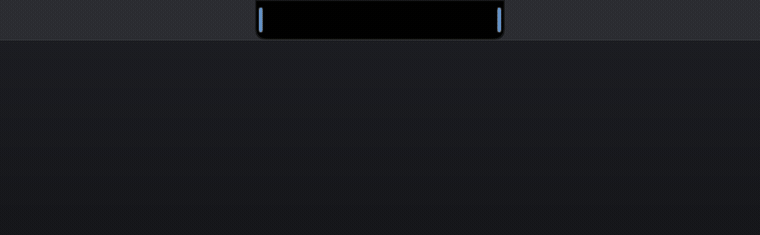
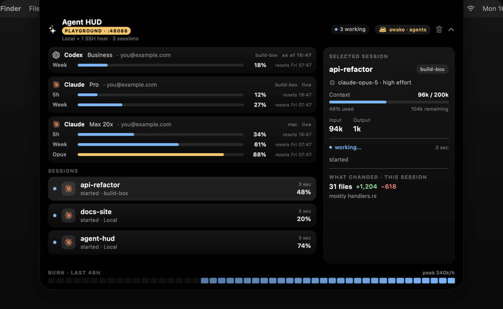

<pre>
 █████╗  ██████╗ ███████╗███╗   ██╗████████╗    ██╗  ██╗██╗   ██╗██████╗
██╔══██╗██╔════╝ ██╔════╝████╗  ██║╚══██╔══╝    ██║  ██║██║   ██║██╔══██╗
███████║██║  ███╗█████╗  ██╔██╗ ██║   ██║       ███████║██║   ██║██║  ██║
██╔══██║██║   ██║██╔══╝  ██║╚██╗██║   ██║       ██╔══██║██║   ██║██║  ██║
██║  ██║╚██████╔╝███████╗██║ ╚████║   ██║       ██║  ██║╚██████╔╝██████╔╝
╚═╝  ╚═╝ ╚═════╝ ╚══════╝╚═╝  ╚═══╝   ╚═╝       ╚═╝  ╚═╝ ╚═════╝ ╚═════╝

              your agents · every machine · one glance

──────────────────────────────────────────────────────────────────────────

  ⚡  Claude, Codex, Cursor — this Mac, SSH boxes, browser tabs
  ●  live sessions with real names, context %, model & effort
  ▎▎  the side bars — pulsing blue means working, orange needs you
  ✓  distinct outcomes: finished, interrupted, error, or unavailable
  ☕  keep-awake that knows when agents are working
  ♪  your music in the notch — Spotify, Apple Music, even YouTube

──────────────────────────────────────────────────────────────────────────
</pre>

# Agent HUD

A small macOS status panel for Claude Code, Codex, Cursor, browser chats, and
other jobs that can send JSON. It lives beside the MacBook notch or on an edge
of an external display. Hover to inspect sessions; click a recorded source
location to return to the work.

<p align="center"></p>

**Version 0.2.2** stops notification loops that immediately reopened dismissed
popups. It includes the 0.2.1 click and mute fixes and the 0.2.0 reliability
release. See [CHANGELOG.md](CHANGELOG.md)
and the [audit resolution notes](docs/reliability-release.md).

## Install

Download `AgentHUD.app.zip` from [Releases](https://github.com/DhruvGoswami10/agent-hud/releases),
unzip, and move AgentHUD.app to Applications. macOS 14 or newer is required.
The Mac app includes its reporter and integration scripts; **Python 3.9+** must
be available on PATH. Release builds are ad-hoc signed, not Apple notarized.
If Gatekeeper blocks a download, use System Settings → Privacy & Security →
Open Anyway after checking its source and the release checksums.

Install the integrations you use:

```sh
python3 '/Applications/AgentHUD.app/Contents/Resources/bin/install-hooks.py'
python3 '/Applications/AgentHUD.app/Contents/Resources/bin/install-hooks.py' --codex --with-hooks
python3 '/Applications/AgentHUD.app/Contents/Resources/bin/install-hooks.py' --cursor
```

The installer makes backups only when configuration changes. It preserves other
hooks and chains the previous Codex notifier. Invalid configuration is left
untouched. Restart existing agent sessions after installing; reload Cursor.
Review and trust the optional Codex lifecycle hooks with `/hooks` in Codex.
They observe events and never approve, deny, or continue an agent action.

For a source checkout:

```sh
make run             # Swift release build, bundle, launch
make hooks           # Claude Code
make hooks-codex      # Codex notify + observational lifecycle hooks
make hooks-cursor    # Cursor
make test            # Swift, Python, browser regression suites
```

Building requires Xcode Command Line Tools / Swift 5.9+, Python 3.9+, and Node
for browser tests. Full Xcode is required to build Safari or Watch targets.

## What the panel means

- Blue: working. Orange: needs attention. Green: an explicitly successful finish.
  Interrupted, error, and unavailable outcomes have separate labels and colors.
- Claude and Codex registry snapshots own their respective sessions; they cannot
  end an unrelated Cursor task or an explicitly named generic integration.
- Codex lifecycle comes from rollout records and optional hooks. A quiet file
  does not mean success; an hour without activity becomes unavailable.
  Rollouts are an internal format, so unknown formats
  remain unknown rather than being guessed into completion.
- Context percentages appear only when the source reports a capacity. Otherwise
  the panel shows tokens used and says capacity is unavailable.
- Rate limits show their observation time. Codex rollout readings without an
  authenticated account ID are labeled **account unverified**, never attributed
  to whoever happens to be signed in later.
- Editing activity is an estimate from successful Edit/Write tool results. It is
  not a Git diff; repeated edits can count again, and shell edits are not included.
- Session and account overflow scrolls within a bounded panel. Music and clipboard
  controls remain below that scroll area. Clear event history leaves sessions intact.

<p align="center"></p>

Screenshots use invented data (`make demo`). The older screenshot illustrates
the visual style; 0.2.0 adds scrolling and more precise status labels.

## Clipboard, music, and keep-awake

Clipboard history ignores concealed, transient, and generated clipboard data.
Re-copying restores original whitespace, text, file URLs, or image bytes.
Large entries that exceed the in-memory history limit say **Preview only** and
cannot overwrite the clipboard with a reduced version.

Spotify, Apple Music, and YouTube can supply now-playing information. An actively
playing native player wins over a paused one. Browser music commands go to the
specific tab. Artwork changes include the source, artist, and URL.

Timed manual keep-awake holds preserve their deadline across restarts. Automatic
holds keep the system awake while agents work or wait for attention, followed
by a short grace period. Keeping the display on and preventing idle lock are
separate: the latter requires Accessibility permission. A closed lid on battery
can still cause macOS to sleep.

## Settings and navigation

The menu bar’s **Settings…** opens Timing, General, Keep Awake, Connections,
and Updates. Connections shows listener, reporter, notification, and remote
version health, browser pairing, and optional Watch connectivity.

Hover or click the notch/edge to open it. ⌥⎋ dismisses it. Keyboard focus and
accessible actions are available for session selection and clipboard chips.
Recorded cmux workspace/surface IDs open the matching local pane. Browser cards
open their conversation URL; Cursor cards can open the workspace. **Open app**
means no exact session locator was supplied. Remote terminal navigation is not
inferred from a remote filesystem path.

On displays without a notch, choose either edge, drag the grip, or use the height
slider. Placement is clamped to the visible screen. Try `make playground-edge`
(`EDGE=left` changes sides); this uses port 48086 and a separate preference domain.

## Browser bridge

Install and pair the [browser extension](extension/README.md) for Chrome-based
browsers or Safari. Version 0.2.0 requires a pairing key copied from Settings →
Connections. Reload chat/music tabs after updating the extension.

Chat activity is inferred from page markup. Navigation, closed tabs, missing
completion evidence, and user stops never claim a successful response. Site
redesigns may require adapter changes. These adapters do not inspect credentials.

## Remote machines

See [remote setup](docs/remote-setup.md). The Mac’s control API binds only to
`127.0.0.1:48085`; SSH reverse tunnels carry remote reports to it. The same-user
local processes and clients on forwarded remote machines are trusted clients.
Ordinary website origins are rejected. Extension origins require pairing.

Put `hosts.conf` and `hosts.json` in `~/Library/Application Support/AgentHUD/`,
or keep the existing files in the source checkout. `AGENT_HUD_ROOT` overrides
the root for portable/source installations. Host files and credentials are not
included in release bundles.

`bin/agent-hud-bootstrap HOST` compares reporter checksums, verifies uploaded
files, updates scripts atomically, and restarts only the HUD reporter when
needed. An already-running old reporter no longer prevents an update. The
persistent tunnel keeper manages only the SSH processes it starts.

## Apple Watch

The companion supports an **opt-in local-network, read-only TLS relay**. Enable
it in Mac Settings → Connections and copy the pairing link. Paste that link into
the Watch app’s Pair Mac screen, using the iPhone keyboard when convenient.
Both devices must reach the same local network. The Watch pins the Mac’s exact
certificate, stores the token in its keychain, and never sends it through redirects.
The relay exposes `/watch` only; the Mac control server stays on loopback.

The companion refreshes while open. It does not promise background alerts or
remote Internet access. Token estimates distinguish 24 hours / 7 days; editing
counts are explicitly scoped to retained sessions. Physical-device installation
requires your Apple development signing/provisioning. Simulator builds are
provided for development, not as an App Store or device-installable release.

```sh
brew install xcodegen
make watch
```

## Event API

`POST http://127.0.0.1:48085/event` accepts generic JSON:

```json
{"event":"done","app":"build","host":"Mac","project":"repo",
 "session_id":"stable-job-id","outcome":"finished","message":"Build finished"}
```

Events: `running`, `attention`, `done`, `info`. Outcomes: `finished`, `interrupted`,
`error`, `unknown`. Include a stable `app` and `session_id`; identity includes the
host and provider. Legacy Claude events remain compatible. Optional `focus`
metadata accepts validated cmux UUIDs or supported conversation URLs, never shell
commands. Retrying clients can include an `event_id` that stays the same for
retries and changes for each new event. The app remembers the last 256 delivery
IDs per launch, scoped by source and event kind; repeats cannot reopen a
dismissed popup, replay sounds, or overwrite newer session state. Codex completion
notifications use their turn ID automatically.

`GET /health` is a liveness check; `/debug` has local diagnostics;
`/watch` is the compact snapshot. Treat diagnostics as private session data.

## Updating and uninstalling

Downloaded app: quit and replace the app with the latest release. Keep it at the
same path so installed hooks continue to resolve. Source checkout:

```sh
bin/agent-hud-update
```

The source updater fast-forwards, builds, and relaunches. It refuses dirty or
diverged tracked work. The app’s update checker only announces releases; it never
installs code automatically. Update configured remote reporters separately with
`agent-hud-bootstrap HOST`.

```sh
make uninstall
# Downloaded installation:
bash '/Applications/AgentHUD.app/Contents/Resources/bin/agent-hud-uninstall'
```

Uninstall unregisters the app login service, removes legacy LaunchAgents, removes
only Agent HUD hooks, and restores the notifier it replaced if that slot is still
owned by Agent HUD. It leaves agent transcripts, the checkout, and backups alone.
Remove the app and browser extensions separately. Remote integrations can be
removed with `python3 ~/agent-hud/bin/install-hooks.py --uninstall` on that host.

## Contributing

MIT: [LICENSE](LICENSE). See [CONTRIBUTING.md](CONTRIBUTING.md) for the design
constraints and test expectations. Windows support and additional provider
adapters remain future work; the generic JSON interface is available today.
